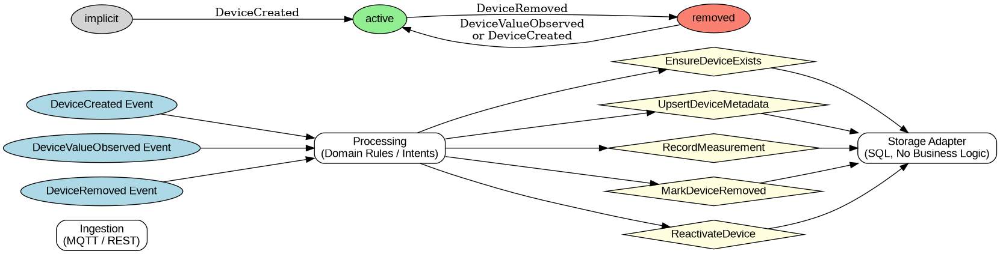

System Goal:
Collect, store and visualize time-based device metrics reliably.

Core Architecture:
Ingestion → Processing → Storage

Design Principles:
- System must tolerate out-of-order events
- No data loss is more important than strict consistency

Processing:
- Responsible for interpreting events
- Applies domain rules
- Produces commands (intents)

Storage:
- Deterministic and side-effect free
- No business logic
- Enforces only data integrity constraints

Out of Scope:
- Dashboards
- Alerting
- Aggregation strategy

---

---